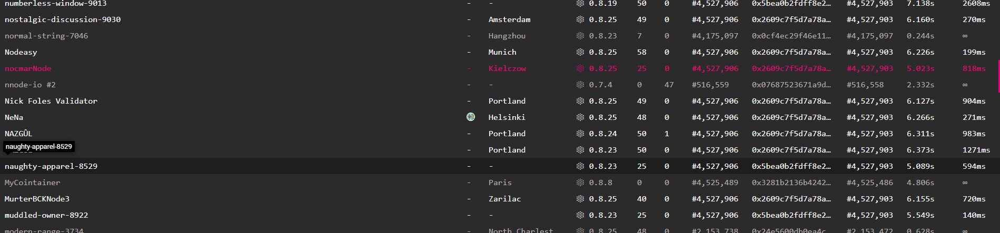
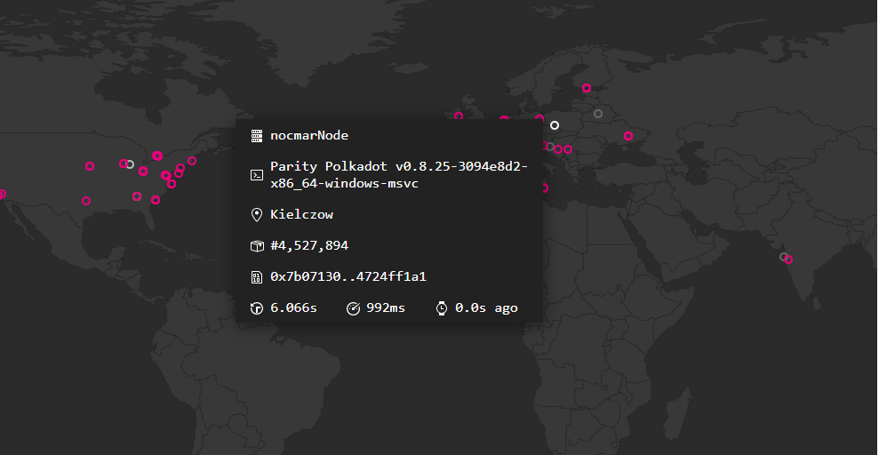
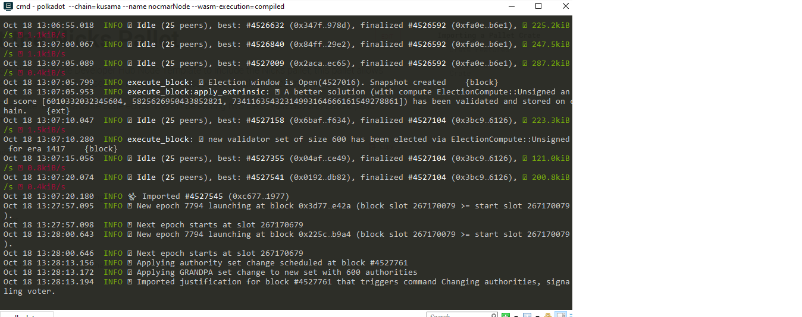

# Run-KusamaNode-For24h

My node called nocmarNode was fully synced around 12AM CET 17.10.2020, since then it was running for 24h (might have some small disconnection period due to lack of fully stable internet connection)

